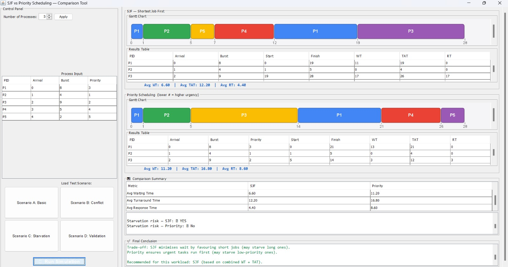
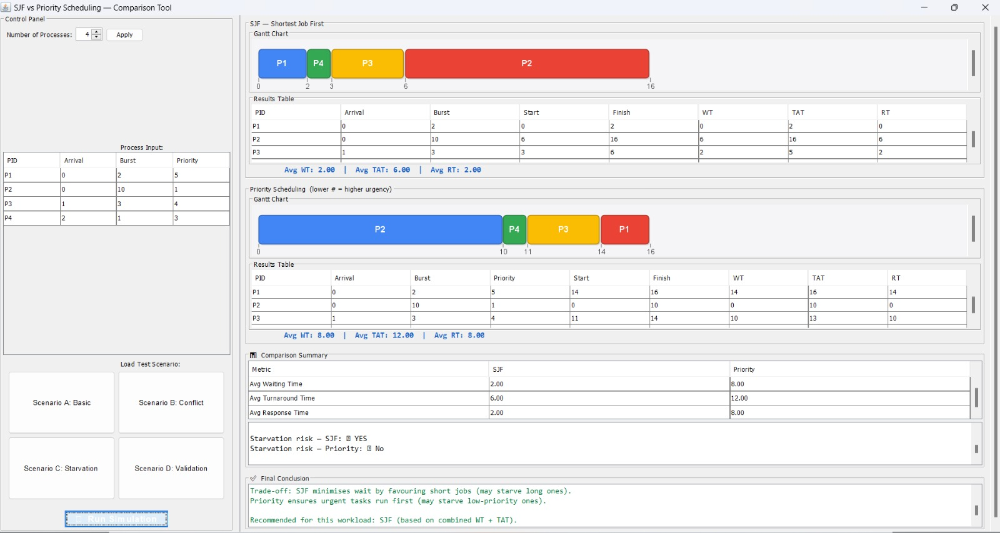
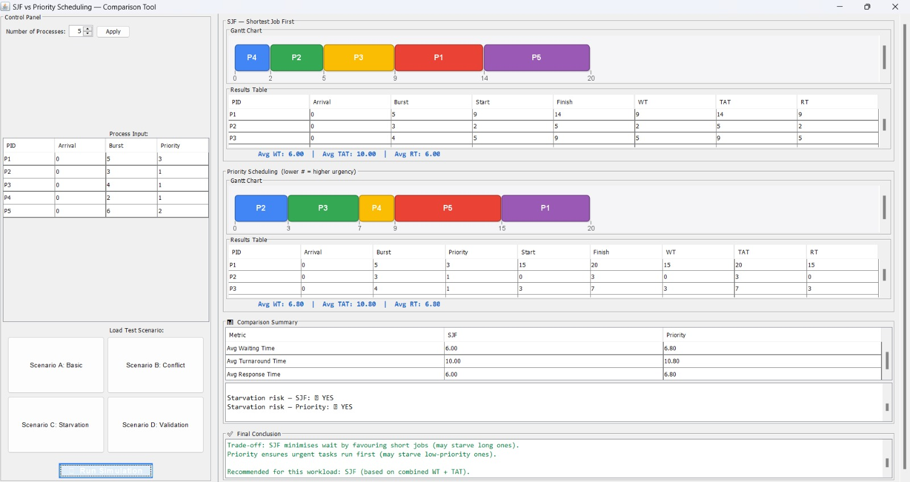
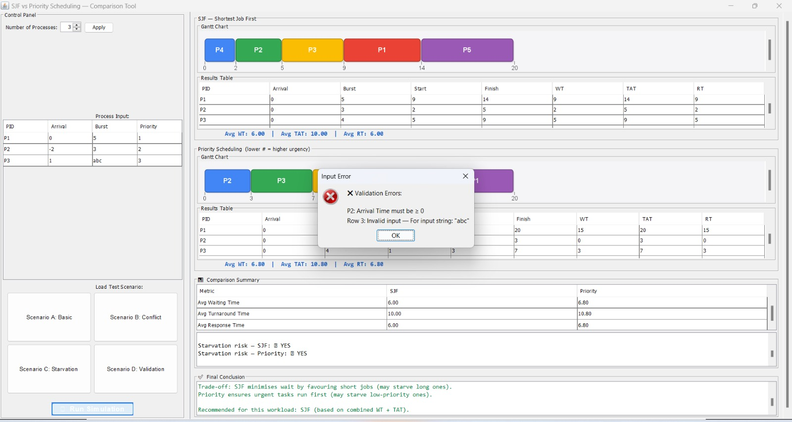

# SJF vs Priority Scheduling — Comparison Project

## Team Members
- Salma Alaa Hamdi Ahmed
- Habibat Allah Ahmed Hamed
- Sara Ashraf Saad Abd El Khalek
- Basmala Mahmoud Mohamed Adel
- Salma Yousry Ismail Fahim
- Rodaina Shazly Mohamed
- Alaa Sayed Anwar

---

## Project Overview
This project implements and compares two CPU scheduling algorithms:
- **Shortest Job First (SJF)** — preemptive
- **Priority Scheduling** — preemptive (lower number = higher urgency)

Both algorithms run on the same workload to produce a valid comparison.

---

## Requirements
- Java 24
- No external libraries required

---

## How to Run
1. Make sure Java 24 is installed
2. Open the project folder in your IDE
3. Open `MainGUI.java`
4. Right-click → Run
5. ---

## Assumptions
- SJF is **preemptive**
- Priority Scheduling is **preemptive**
- Lower priority number = higher urgency (Priority 1 = most urgent)
- Ties in burst time (SJF) are broken by arrival time (FCFS)
- Ties in priority are broken by arrival time (FCFS)
- All processes are CPU-bound with no I/O bursts

---

## Metrics Calculated
For each process: **WT** (Waiting Time), **TAT** (Turnaround Time), **RT** (Response Time)
Plus averages across all processes for both algorithms.

---

## Test Scenarios

### Scenario A — Basic Mixed Workload
Normal workload with 5 processes, different arrival times, burst times, and priorities.

| PID | Arrival | Burst | Priority |
|-----|---------|-------|----------|
| P1  | 0       | 8     | 3        |
| P2  | 1       | 4     | 1        |
| P3  | 2       | 9     | 2        |
| P4  | 3       | 5     | 4        |
| P5  | 4       | 2     | 5        |

| Metric | SJF | Priority |
|--------|-----|----------|
| Avg Waiting Time | 6.60 | 11.20 |
| Avg Turnaround Time | 12.20 | 16.80 |
| Avg Response Time | 4.40 | 8.60 |

**Observation:** SJF outperforms Priority on all three metrics in this workload.

---

### Scenario B — Conflict Between Burst Time and Priority
Short-burst low-priority process vs long-burst high-priority process.

| PID | Arrival | Burst | Priority |
|-----|---------|-------|----------|
| P1  | 0       | 2     | 5        |
| P2  | 0       | 10    | 1        |
| P3  | 1       | 3     | 4        |
| P4  | 2       | 1     | 3        |

| Metric | SJF | Priority |
|--------|-----|----------|
| Avg Waiting Time | 2.00 | 8.00 |
| Avg Turnaround Time | 6.00 | 12.00 |
| Avg Response Time | 2.00 | 8.00 |

**Observation:** SJF significantly outperforms Priority. Priority forces long high-priority jobs to run first, increasing wait time for all others.

---

### Scenario C — Starvation-Sensitive Case
Workload designed to reveal starvation risk under Priority Scheduling.

| PID | Arrival | Burst | Priority |
|-----|---------|-------|----------|
| P1  | 0       | 5     | 3        |
| P2  | 0       | 3     | 1        |
| P3  | 0       | 4     | 1        |
| P4  | 0       | 2     | 1        |
| P5  | 0       | 6     | 2        |

| Metric | SJF | Priority |
|--------|-----|----------|
| Avg Waiting Time | 6.00 | 6.80 |
| Avg Turnaround Time | 10.00 | 10.80 |
| Avg Response Time | 6.00 | 6.80 |

**Observation:** Starvation risk detected in both algorithms. SJF produces slightly better metrics.

---

### Scenario D — Validation Case
Invalid input is loaded to verify the simulator rejects bad data safely.

- P2: negative arrival time (-2)
- P3: non-numeric burst time (abc)

**Result:** Simulator correctly detected and reported both errors before running the simulation.

---

## Limitations
- The simulator does not support I/O bursts or context switch overhead
- Gantt chart is static (not animated)
- Results table requires scrolling when process count is high
- Must be launched via command line with `-Duser.language=en` flag on Arabic-locale machines

---

## Conclusion

| Metric | Winner |
|--------|--------|
| Avg Waiting Time | SJF |
| Avg Turnaround Time | SJF |
| Avg Response Time | SJF |
| Urgent task treatment | Priority Scheduling |
| Fairness | SJF |

- **SJF** consistently produced lower average WT and TAT by favouring short jobs
- **Priority Scheduling** ensures urgent processes are served first but causes higher average wait for others
- **Main trade-off:** SJF optimises for efficiency; Priority optimises for urgency
- **Starvation risk** was observed in both algorithms under certain workloads
- **Recommendation:** For general-purpose workloads, SJF is more efficient. For real-time systems, Priority Scheduling is more appropriate.
3. Open Command Prompt
4. Navigate to the project folder
5. Run:
